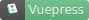

# Casual UI


## 介绍

一个支持 React17, Vue3, Svelte3 的组件库

## 功能特性

- 超小的代码体积
- 使用 TS 编写
- 支持暗黑模式
- 支持主题定制
- 强大且灵活的表单

## 在线示例 & 文档

- [Casual UI - React](https://casual-ui-react.donsen.site/) （目前仅有中文）
- [Casual UI - Vue](https://casual-ui-vue.donsen.site/) （目前仅有中文）
- [Casual UI - Svelte](https://casual-ui-svelte.donsen.site/) （目前仅有英文）

## 安装 & 使用

### Vue3+ 用户

- 安装依赖

```sh
npm install casual-ui-vue
```

- 全局使用

```js
import { createApp } from 'vue'
import CasualUI from 'casual-ui-vue'
import 'casual/style.css'

const app = createApp()
app.use(CasualUI)
app.mount('#app')
```

- 按需使用

**注意：按需使用也需要导入样式**

```vue
<!-- SomeComponent.vue -->
<script setup>
import { CButton } from 'casual-ui-vue'
</script>
<template>
  <c-button label="一个按钮" />
</template>
```

### React17+用户

- 安装依赖

```sh
npm install casual-ui-react
```

- 入口文件导入样式

```js
import 'casual-ui-svelte/dist/style.css'
```

- 使用

```js
import { CButton } from 'casual-ui-react'

function SomeComponent() {
  return <CButton label="一个按钮" />
}
```

### Svelte3+ 用户

- 安装依赖

```sh
npm install -D casual-ui-svelte
```

- 入口文件导入样式

```js
import 'casual-ui-svelte/style.css'
```

- 在.svelte 文件中使用

```html
<script>
  import { CButton } from 'casual-ui-svelte'
</script>
<CButton label="一个按钮" />
```

## 参与贡献

[贡献指南](./CONTRIBUTING.md)

## 鸣谢





## 协议

[MIT](./LICENSE)
